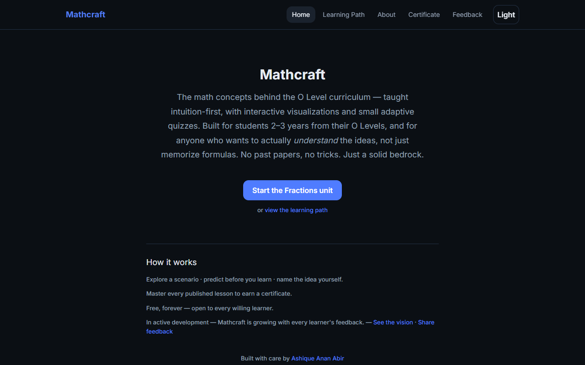
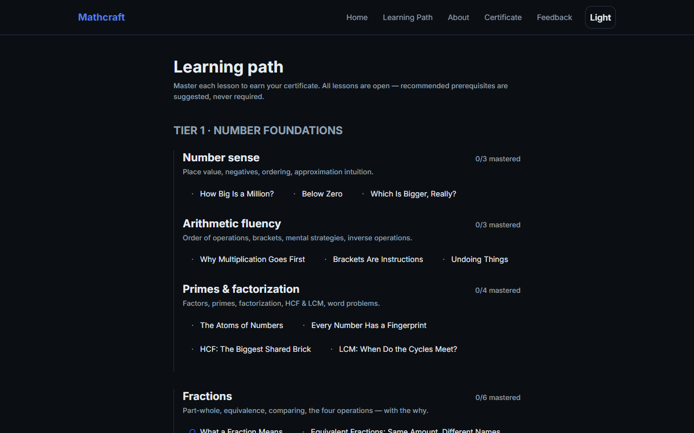
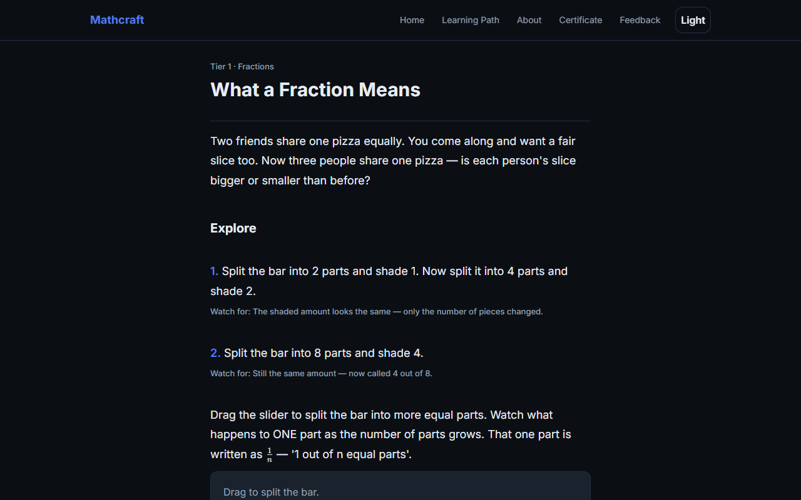
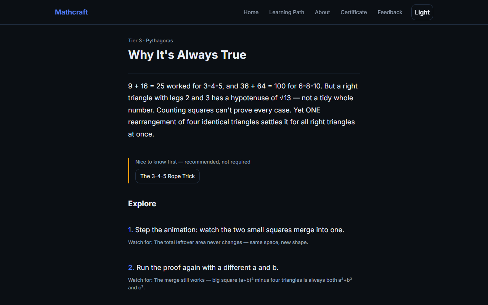

# Mathcraft — O Level Math, from the ground up

Free, open-source, interactive lessons that build the fundamental building blocks of O Level Mathematics.

**[🌐 Visit the live site](https://ashiqueanan.github.io/mathcraft/)** · Interactive O Level math concepts, opened to every willing learner.

---

## Why this exists

> **Mathcraft** is a free, open-source, interactive website that teaches the *math concepts behind the O Level curriculum* — covering the foundations of both Cambridge O Level Mathematics (4024) and Additional Mathematics (4037).
>
> It is built for students who are 2–3 years away from their O Level exams. It is deliberately **not** an exam-prep tool: no past papers, no mark schemes, no tricks. Instead, every concept is taught intuition-first with interactive visualizations, then verified with small adaptive quizzes. A student who finishes this site should be able to walk into any O Level classroom and find every topic approachable, because the bedrock underneath is solid.
>
> Built with ❤️ so any student with a phone and a patchy internet connection can learn real math for free.

---

## Who it's for

- **Age 12–14**, self-directed learners.
- Primary-school arithmetic assumed; **no formal algebra or geometry assumed**.
- English as a second language is expected — simple, direct sentences (CEFR B1); math terminology stays exact.
- May be on a **low-end Android phone with unstable internet**.
- **Philosophy: fundamentals first, not exam prep.** No past papers, no mark schemes, no exam tricks — just a solid bedrock.

**The 7 Pedagogy Rules** (applied to every lesson): hook before content · intuition before notation · every concept gets a why · interact every screen · mistakes are data · retrieval, not review · one clear next step.

---

## Screenshots

| Landing | Skill map | Lesson (fractions) | Lesson (Pythagoras proof) |
|---|---|---|---|
|  |  |  |  |

Screenshots captured from the production static export (desktop viewport).

---

## Features

### Shipped (Phase 1)
- [x] Next.js App Router + TypeScript + Tailwind app shell
- [x] Design tokens per spec (dark default + light toggle)
- [x] Lesson schema (Section 4 blueprint) + content loader
- [x] **Tier 1 — all 36 lessons complete (U1–U10)** with 5-beat discovery flow, ≥1 interactive widget per lesson, diagnosed-feedback quizzes
- [x] **Tier 2 — all 31 lessons complete (U11–U19)**; U14-L1 debuts BalanceScale, U18-L4 debuts graph-interact — both with e2e happy paths
- [x] **Tier 3 — all 29 lessons complete (U20–U27)**; U21-L4 debuts CircleTheoremExplorer, U25-L2 debuts AnimatedProof (flagship) — both with e2e happy paths
- [x] **Tier 4 — all 8 lessons complete (U28–U29)**; U29-L3 debuts TreeDiagramBuilder (flagship) — with e2e happy path
- [x] **Tier 5 — all 12 lessons complete (U30–U33)**; T5-U31-L1 is the AnimatedProof 2nd flagship (completing the square) — with e2e happy paths
- [x] Quiz engine: 7 question types (`mcq`, `numeric-input`, `fraction-input`, `true-false-justify`, `drag-match`, `order-steps`, `graph-interact`), fixed composition (2 procedural + 2 conceptual + 1 word), ≥80% pass, randomized retakes (every lesson ships a ≥15-question pool — ≥3× the 5-question sitting)
- [x] Lesson quality gate: `npm run lint:lessons` validates every built lesson (hook, widgets, discovery ≥2 challenges + predict + say-it-your-way, formal blocks, ≥15 pool, 3 hints per question, diagnoses, commonMistakes ≥3, stretch) — CI-fails the build on any shallow lesson
- [x] e2e happy paths for U1, U5, U7 (derived answers via shared `quiz-helpers`) + mobile smoke over every Tier-1 lesson (zero console errors)
- [x] **Interactive widget library (11)**: FractionBars & FractionCircles (with linked fraction ↔ decimal ↔ percentage readouts), NumberLine, BalanceScale, GraphPlotter, GeometryPlayground, CircleTheoremExplorer, VennDiagram, TreeDiagramBuilder, AnimatedProof, RatioBar — keyboard/touch accessible, lazy-loaded through `WidgetRenderer`
- [x] ProgressStore (Zustand + localStorage): mastery states `locked → available → in-progress → mastered`, spaced-recall scheduling (3-day checks), warm-up selection (oldest last-seen + lowest accuracy weighting), remediation routing to weakest prerequisite
- [x] Landing page with "one clear next step"
- [x] Skill map: all 116 curriculum lesson nodes with mastery styling
- [x] Offline support: custom service worker — network-first for pages (always serves the latest deploy when online), cache-first for hashed static assets
- [x] PWA manifest + icon
- [x] Unit tests (Vitest) for quiz engine & progress store
- [x] Playwright e2e happy path (phone viewport: learn → quiz pass → progress survives reload, zero console errors)
- [x] **About page** — the story: made for a cousin, opened as a free community service (creator: Ashique Anan Abir, portfolio linked)
- [x] **Guided path with prerequisites** — each lesson unlocks the next; "Nice to know first" suggestions explain the chain on every lesson
- [x] **Auto certificate** (`/certificate`) — earned when all published lessons are mastered; asks the student's name, issued by **Mathcraft**, printable to PDF
- [x] **Feedback** (`/feedback` + per-lesson "Tell me" link) — category picker, pre-filled email to the creator
- [x] **Google Analytics (GA4)** — live with `G-SS92F2Q4PL`, baked into the static build (env override via `NEXT_PUBLIC_GA_ID`)
- [x] **GitHub Pages ready** — static export with base path, GitHub Actions deploy workflow

### Shipped (Phase G — full-curriculum polish)
- [x] **"Explain differently"** on every formal block — 2 authored analogy variants per block across all 116 lessons
- [x] **"I'm stuck"** on every quiz question — 3-level hint tree revealed one at a time
- [x] **Optional configurable AI tutor** — OpenAI-compatible endpoint (`NEXT_PUBLIC_LLM_ENDPOINT` / `NEXT_PUBLIC_LLM_KEY`): Socratic persona per spec; site is 100% functional with LLM disabled
- [x] **Route-level code splitting** — widgets lazy-loaded; landing page JavaScript 153 KB gzipped (<200 KB target)
- [x] **prefers-reduced-motion honored** — all animation/transition disabled for reduced-motion users
- [x] **README 100% truthful** — curriculum counts, screenshots, and features match the shipped build

### Roadmap (later phases)
- [x] Full question-type engine (`drag-match`, `order-steps`, `graph-interact`) — shipped Phase 2
- [x] Full mastery state machine + spaced-repetition scheduler + adaptive remediation flow UI — shipped polish pass: warm-up recall card on the landing page (once per day, skippable), demotion + recheck queue on wrong recall, remediation link routes to the weakest prerequisite with a "Welcome back" banner
- [x] "Explain differently" (hint-tree fallback + configurable LLM tutor) — shipped Phase G
- [x] Tier 2 content (Modules 4–6) — full Algebra Foundations tier shipped (Phase D)
- [x] Tier 3 + Tier 4 content (Modules 7–10) + GeometryPlayground, CircleTheoremExplorer, AnimatedProof, TreeDiagramBuilder — full tier shipped (Phase E)
- [x] Tier 5 bridges (Modules 11–14) — full Additional Mathematics tier shipped (Phase F)
- [x] AI tutor (provider slot) + PWA polish + a11y & performance audits — shipped Phase G

---

## Curriculum map

**5 Tiers → 14 Modules → 30 Units → 116 Lessons** (lesson IDs: `T{tier}-U{unit}-L{lesson}`).

| Tier | Modules | Units | Lessons | Status |
|------|---------|-------|---------|--------|
| 1 — Number Foundations | 1–3 | U1–U10 | 36 | **36/36 complete (Tier 1 done)** |
| 2 — Algebra Foundations | 4–6 | U11–U19 | 31 | **31/31 complete (Tier 2 done)** |
| 3 — Geometry & Measurement | 7–9 | U20–U27 | 29 | **29/29 complete (Tier 3 done)** |
| 4 — Data & Probability | 10 | U28–U29 | 8 | **8/8 complete (Tier 4 done)** |
| 5 — Additional Mathematics Bridges | 11–14 | U30–U33 | 12 | **12/12 complete (Tier 5 done)** |

**Tier 1 — Number Foundations (36/36 complete, Phase C):**
- **U1 Number sense**: How Big Is a Million? · Below Zero · Which Is Bigger, Really?
- **U2 Arithmetic fluency**: Why Multiplication Goes First · Brackets Are Instructions · Undoing Things
- **U3 Primes & factorization**: The Atoms of Numbers · Every Number Has a Fingerprint · HCF · LCM
- **U4 Fractions** (retrofitted to the 5-beat flow + expanded pools): What a Fraction Means · Equivalent Fractions · Comparing Fractions · Adding & Subtracting · Multiplying · Dividing
- **U5 Decimals & percentages**: One Idea, Three Costumes · Percent of What? · Growing and Shrinking · Back to the Original
- **U6 Ratio & proportion**: Recipes and Rescaling · Sharing Fairly · Double or Invert?
- **U7 Indices**: Folding Paper to the Moon · The Laws Write Themselves · The Power of Zero (and Less) · Half a Power
- **U8 Roots & surds**: The Side of a Square of Area 2 · Tidying Surds · Why We Rationalize
- **U9 Standard form & accuracy**: Writing the Unwritable · How Honest Is This Number? · Estimate First, Calculate Second
- **U10 Sets**: Sorting the World · Overlap Logic · Venn Word Problems

**Tier 2 — Algebra Foundations (31/31 complete, Phase D):**
- **U11 Variables & expressions**: What Is a Variable? · Making Sense of Expressions · Evaluating with Order
- **U12 Manipulation**: Collecting Like Terms · Multiplying and Expanding Brackets · Factoring · Completing the Square
- **U13 Formulas**: Rearranging Formulas · Formulas in Real Life · Substitution
- **U14 Solving equations**: The Balance (BalanceScale debut) · Two-Step Equations · Equations with x on Both Sides · Words Into Equations
- **U15 Simultaneous & quadratic equations**: Two Clues, Two Unknowns · Elimination and Substitution · When Graphs Cross at Two Places · The Formula That Never Fails
- **U16 Inequalities**: Ranges, Not Points · Solving Inequalities (and the Flip) · Whole-Number Answers
- **U17 Sequences**: What Comes Next, and Why · Jump Straight to the 100th Term · Doubling Patterns
- **U18 Coordinates & straight lines**: The Grid That Changed Math · Steepness Is a Number · y = mx + c, Own It · Lines from Clues (graph-interact debut)
- **U19 Curves**: The Parabola's Signature · New Shapes: Cubics and Reciprocals · Solving with Graphs

**Tier 3 — Geometry & Measurement (29/29 complete, Phase E):**
- **U20 Angle reasoning**: Angles Around a Point · When Lines Cross · The Parallel Line Trick · Every Triangle Holds 180°
- **U21 Polygons & circles**: Chopping Polygons Into Triangles · The Exterior Walk · A Family of Shapes · The Circle's Hidden Laws (CircleTheoremExplorer debut)
- **U22 Construction & symmetry**: Compass Logic · Everywhere That's Allowed · Mirror and Spin
- **U23 Length, area, volume**: Area Is Counting Squares · The Trapezium Compromise · π Lives Here · Boxes, Skins, and Space
- **U24 Compound & real problems**: Frankenstein Shapes · Slices of a Circle · Paint, Tiles, and Fencing
- **U25 Pythagoras**: The 3-4-5 Rope Trick · Why It's Always True (AnimatedProof flagship debut) · Finding Any Side · Is It Right-Angled?
- **U26 Trigonometry fundamentals**: The Ratio That Only Cares About the Angle · Meeting Cosine and Tangent · Finding Sides, Finding Angles · The Special Three
- **U27 Transformations & coordinates**: Slide, Flip, Turn, Grow · Enlargements From a Center · Distance and Midpoint

**Tier 4 — Data & Probability (8/8 complete, Phase E):**
- **U28 Data & averages**: Three Ways to Be Average · When Averages Lie · Reading Charts Like a Skeptic · Do These Things Move Together?
- **U29 Probability**: The Chance Line · Theory vs Reality · Two Things Happening (TreeDiagramBuilder debut) · Independent or Not?

**Tier 5 — Additional Mathematics Bridges (12/12 complete, Phase F):**
- **U30 Functions**: The Machine Called f · Machines in Series (and Reverse) · Moving Graphs Around
- **U31 Quadratics in depth**: Completing the Square, Literally (AnimatedProof 2nd flagship) · Vertex Form Tells All · The Discriminant's Crystal Ball
- **U32 Exponentials & logarithms**: Growth That Eats the World · The Logarithm Is a Question · Solving the Unsolvable, Plus Pascal's Shortcut
- **U33 Polynomials & further trig**: Polynomial Arithmetic and a Clever Plug-In · Beyond Right Triangles · Two Identities You Already Own

Every lesson follows **The MathCraft Way** (5-beat discovery): hook (scenario) → explore (widget + micro-challenges) → predict (commit before reveal) → "say it your way" → practice & retrieve (quiz + stretch teaser). Each quiz draws from a **≥15-question pool** with explained answers, 3-level hint trees, and diagnosed feedback.

---

## Tech stack & architecture

- **Framework:** Next.js (App Router) + TypeScript + Tailwind CSS
- **Math:** KaTeX
- **State:** Zustand (with persist middleware)
- **Widgets:** custom React/SVG + Framer Motion (shipped dependency used by widget animations)
- **Offline:** custom service worker (`public/sw.js`) + PWA manifest
- **Tests:** Vitest + Testing Library, Playwright (e2e)

```
mathcraft/
├─ public/
│  ├─ sw.js                 # offline service worker
│  ├─ manifest.webmanifest  # PWA manifest
│  └─ icon.svg              # app icon (½)
├─ src/
│  ├─ app/                  # App Router pages
│  │  ├─ page.tsx           # landing
│  │  ├─ map/               # skill map (tier road)
│  │  ├─ lesson/[id]/       # lesson blueprint page
│  │  ├─ layout.tsx         # root layout (Inter, KaTeX, theme)
│  │  └─ globals.css        # design tokens
│  ├─ components/
│  │  ├─ math/              # KaTeX Math + RichText
│  │  ├─ quiz/              # Quiz runner (diagnosed feedback, remediation)
│  │  ├─ theme/             # ThemeProvider (dark default + toggle)
│  │  ├─ widgets/           # FractionBars, FractionCircles, NumberLine, BalanceScale, GraphPlotter, GeometryPlayground, CircleTheoremExplorer, VennDiagram, TreeDiagramBuilder, AnimatedProof, RatioBar + WidgetRenderer
│  │  └─ offline/           # service-worker registration
│  ├─ content/
│  │  ├─ schema.ts          # Lesson Blueprint (Section 4)
│  │  ├─ curriculum.ts      # 5 tiers / 14 modules / 30 units registry
│  │  └─ lessons/           # 116 authored lessons (T1-U1-L1..T5-U33-L3) + loader
│  └─ lib/
│     ├─ quiz-engine.ts     # session build, scoring, diagnosis
│     ├─ progress-store.ts  # mastery, spaced recall, warm-ups, remediation
│     └─ __tests__/         # Vitest unit tests
├─ e2e/                     # Playwright specs
├─ vitest.config.ts
└─ playwright.config.ts
```

---

## Getting started

> **Note on Node:** this project was verified with the portable Node.js LTS distributed in the repo's `.tools/` folder (no system install needed). The machine this was built on has no system Node; the `.tools/node-v22.14.0-win-x64` binaries are used for all commands.
> If you have Node.js ≥ 18.17 installed (or via nvm), you can use plain `npm`.

```bash
# From the mathcraft/ directory
npm install
npm run dev        # http://localhost:3000
```

With the portable toolchain (Windows, no system Node):

```bash
set "PATH=%CD%\.tools\node-v22.14.0-win-x64;%PATH%"
cd mathcraft
npm run dev
```

**Tests:**
```bash
npm test           # Vitest unit tests (quiz engine, progress store)
npm run typecheck  # TypeScript check
npx playwright install chromium   # one-time browser download, required for e2e
npm run test:e2e   # Playwright (phone viewport happy path; starts dev server on :3200)
```

**Node version:** 22 (LTS). **Recommended:** Node ≥ 20.

---

## How to add a lesson

1. **Pick a slot** from the curriculum map — every lesson already has an ID (e.g. `T1-U5-L1`) in `src/content/curriculum.ts`.
2. **Create the file** `src/content/lessons/T1-U5-L1.ts` exporting a `Lesson` object (type from `src/content/schema.ts`).
3. **Fill the blueprint:** `hook` (puzzle/paradox/real-world) → `discovery` (challenges + predict + say-it-your-way) → `intuitionBlocks` (pick a widget from the library, write the narrative and a prediction) → `formalBlocks` (definition, exactly 2 worked examples, one "watch out" pitfall, and `altExplanations` — exactly 2 analogy variants per block) → `gutChecks` → `quiz` (pool with **at least** 2 procedural + 2 conceptual + 1 word per sitting — aim for ≥ 3× the sitting size so retakes differ; include `diagnoses` on every MCQ distractor and a 3-level `hints` tree per question) → `commonMistakes` (these feed the feedback engine).
4. **Register it** in `src/content/lessons/index.ts` (import + add to `BUILT_LESSONS`).
5. **Verify:** run `npm run typecheck`, `npm run lint:lessons` (quality gate — fails on missing discovery, `altExplanations`, 3 hints, diagnoses, commonMistakes ≥3), `npm test`, and manually click through the lesson on a phone-width viewport.
6. **Tip:** use the scaffolder `node scripts/new-lesson.mjs <ID> "<Title>" --unit "<Unit>" --tier <n>` to generate a valid, compiling skeleton with anchor comments marking each fill region.

---

## Roadmap

See **Roadmap** in Features above, and Phase 2–6 in the original product spec:

- **Phase 2 — Engines complete:** full 7-type question engine shipped; mastery state machine + spaced-repetition scheduler + remediation flow shipped (warm-up card, demotion/recheck, remediation routing). Widget library (11) + linked fraction readouts shipped.
- **Phase 3 — Tier 1 + Tier 2 content** (Modules 1–6, 67 lessons) — **complete**.
- **Phase 4 — Tier 3 + Tier 4** (Modules 7–10, 37 lessons) incl. GeometryPlayground, CircleTheoremExplorer, AnimatedProof, TreeDiagramBuilder — **complete**.
- **Phase 5 — Tier 5 bridges** (Modules 11–14) — **complete** (12 lessons).
- **Phase 6 — AI tutor + PWA polish + a11y & performance audits — shipped (Phase G).** Full curriculum: 116 lessons complete.

---

## Contributing

Contributions are warmly welcomed — **especially content PRs** from educators and students.

- **Educators:** the lesson schema is plain TypeScript data; you can write a lesson without touching any UI code. See "How to add a lesson" above.
- **Students:** spot a confusing sentence, a wrong diagnosis, or a missing widget? Open an issue or PR.
- **Developers:** the architecture keeps content pure (data) separate from engines (logic) separate from UI (components). Follow the existing patterns and run the test suites before submitting.

Please keep the [7 pedagogy rules](#who-its-for) in mind for any content change.

---

## Creator

Built with ❤️ by **[Ashique Anan Abir](https://ashiqueanan.github.io/portfolio/)**.

Start from a cousin who needed help with maths; open to every child who is willing to learn. Feedback is always welcome — use the [Feedback](/feedback) page or email **abirashique@gmail.com**.

---

## License

MIT — use it, study it, remix it. If it helps one student, it was worth it.
